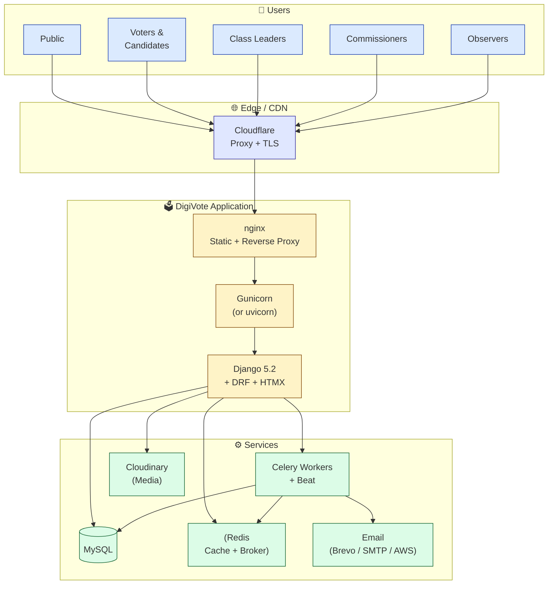
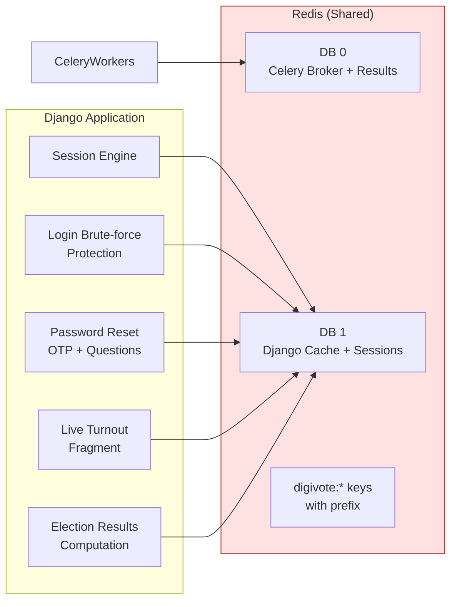
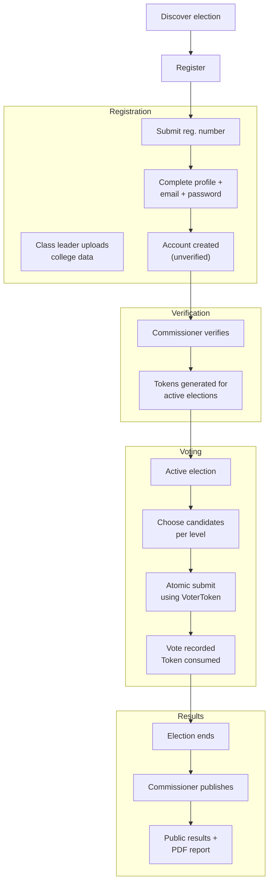
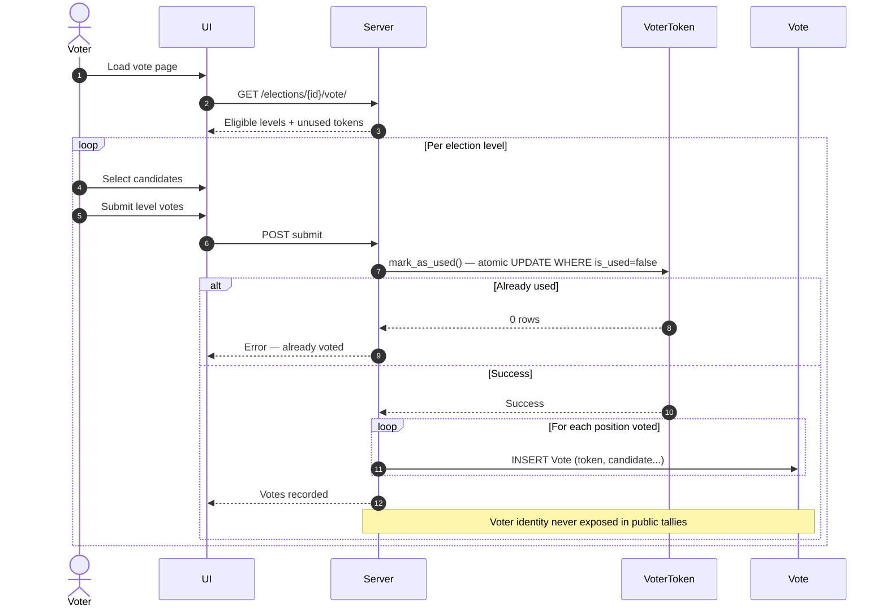
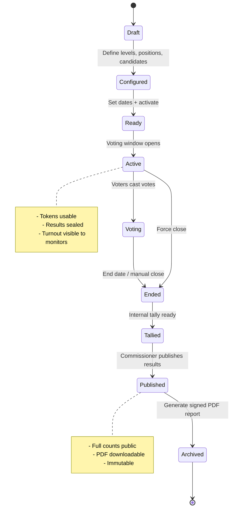
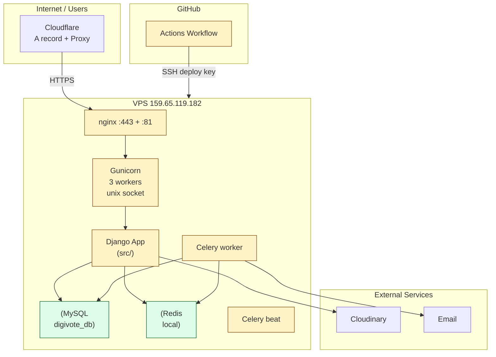
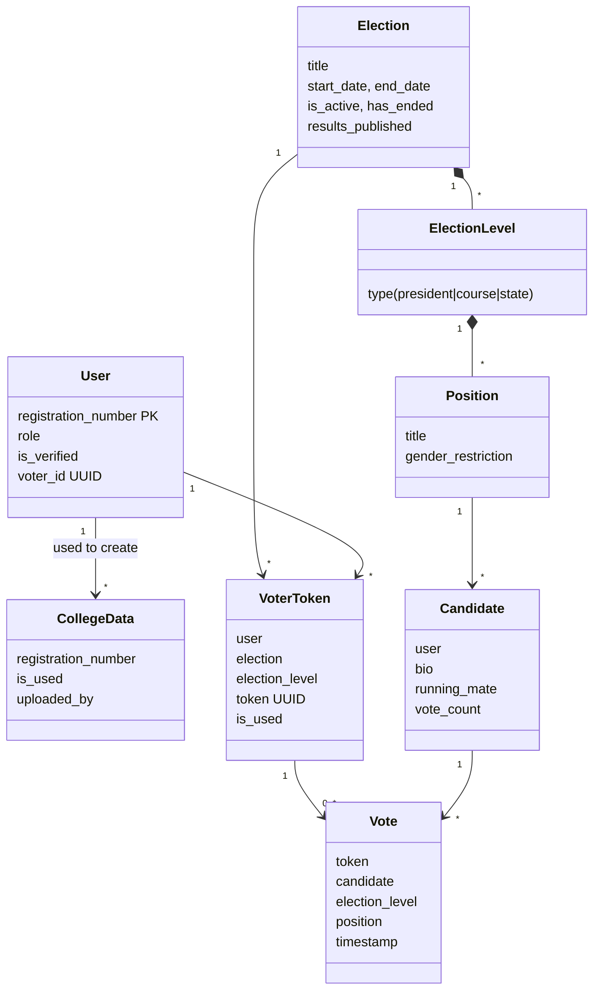

# MWECAU DigiVote — Architecture Documentation

MWECAU DigiVote is the official electronic voting platform for Mwenge Catholic University (MWECAU) student elections. This repository provides the **public architecture documentation** for the system.

It is designed as a clean, standalone resource for the MWECAU IT Department, university staff, student contributors, and other institutions interested in digital election systems. The documentation covers high-level design, key processes, technology choices, and visual diagrams — without exposing application source code or operational secrets.

**Key Highlights**
- Mermaid diagrams for system overview, data flows, security model, and deployment
- Documentation on MySQL database, flexible email backends (Brevo / SMTP / AWS SES), caching, and scalability
- Focus on secure, auditable, one-person-one-vote election processes

> All diagrams are written in [Mermaid](https://mermaid.js.org/) and render natively on GitHub.

## Table of Contents

- [System Overview](#system-overview)
- [Core Components](#core-components)
- [Cache Layer (Redis)](#cache-layer-redis)
- [Background Processing (Celery)](#background-processing-celery)
- [Documentation Structure](#documentation-structure)
- [Email Options](#email-options)
- [User Roles & Permissions](#user-roles--permissions)
- [Voter Journey](#voter-journey)
- [Secure Voting Process](#secure-voting-process)
- [Election Lifecycle](#election-lifecycle)
- [Deployment Architecture](#deployment-architecture)
- [Data Model Overview](#data-model-overview)
- [Security & Integrity](#security--integrity)
- [Request Lifecycle](#request-lifecycle)

---

## System Overview



---

## Core Components

| Layer              | Technology                          | Purpose |
|--------------------|-------------------------------------|-------|
| Frontend           | Django Templates + HTMX + Tailwind  | Responsive UI, partial updates |
| Backend            | Django 5.2 + Django REST Framework  | Core logic, auth, APIs |
| Authentication     | Custom RegistrationNumberBackend    | Login by university reg. number |
| Sessions           | Cached sessions (Redis)             | Fast, scalable session storage |
| Database           | MySQL (primary)                     | All persistent data |
| Cache & Broker     | Redis (django-redis + Celery)       | Caching + async messaging |
| Task Queue         | Celery + django-celery-beat         | Email, notifications, scheduled jobs |
| Media Storage      | Cloudinary                          | Candidate photos, PDF reports |
| Email              | Brevo / SMTP / AWS SES + Celery     | Transactional emails |
| Web Server         | nginx + Gunicorn                    | Production serving |
| Proxy / TLS        | Cloudflare (in front of nginx)      | DDoS protection, TLS termination |
| Deployment         | GitHub Actions + SSH to VPS         | Automated deploys |

---

## Documentation Structure

```
.
├── README.md                 # High-level overview + key diagrams
├── docs/
│   ├── authentication.md
│   ├── contributing.md
│   ├── database-mysql.md
│   ├── email-configuration.md
│   ├── email-options.md
│   ├── monitoring-and-logging.md
│   ├── scalability.md
│   ├── security-model.md
│   └── why-mysql.md
├── diagrams/                 # Standalone Mermaid diagrams
├── CACHE-LAYER.md
├── COMPONENTS.md
├── DEPLOYMENT.md
├── FLOWS.md
└── SECURITY.md
```

All documentation is written to be suitable for public sharing with the MWECAU IT department and other institutions. No secrets or internal operational details are included.

---

## Cache Layer (Redis)

Redis is central to performance and correctness.

### Cache Usage Map



### Caching Strategies

| Component                | Key Pattern                     | TTL (typical)      | Invalidation |
|--------------------------|---------------------------------|--------------------|--------------|
| Login attempts / lockout | `login_attempts:REG`, `login_lockout:REG` | 15 min            | On success or expiry |
| Password reset OTP       | `pwd_reset_otp:{user_id}`       | 10 min             | On use / expiry |
| Password reset questions | `pwd_reset_q_set:REG`           | 10 min             | On success |
| Election turnout         | `election_turnout:{id}`         | 10 seconds         | Time-based |
| Election results         | `election_results:{id}`         | 30s (active) / 1h (ended) | On vote submit + election end |
| General Django cache     | `digivote:*`                    | 5 minutes default  | Manual or timeout |

**Important design decisions:**
- Results cache uses short TTL during active voting to reduce load while still protecting final tallies behind the `results_published` flag.
- Brute-force protection and password reset state live **only in cache** (ephemeral by design).
- Sessions are stored in Redis for easy horizontal scaling.

---

## Background Processing (Celery)

```mermaid
flowchart TB
    subgraph Producers["Task Producers"]
        Views[Web Views]
        Admin[Admin Actions]
        Beat["Celery Beat\n(scheduled)"]
    end

    subgraph Queues["Redis Queues"]
        EmailQ[email_queue]
        NotifQ[notification_queue]
    end

    subgraph Workers["Celery Workers"]
        EmailWorker["Email Worker\n(lower concurrency)"]
        NotifWorker[Notification Worker]
    end

    subgraph Effects["Side Effects"]
        EmailSvc[Email (Brevo/SMTP/AWS)]
        DB[(MySQL)]
        Cache[(Redis Cache)]
    end

    Views --> EmailQ
    Views --> NotifQ
    Admin --> NotifQ
    Beat --> NotifQ

    EmailQ --> EmailWorker --> EmailSvc
    NotifQ --> NotifWorker --> DB
    NotifQ --> NotifWorker --> Cache

    NotifWorker -->|token issuance| DB
    NotifWorker -->|result invalidation| Cache
```

**Key tasks include:**
- User verification + voter token issuance on email verification
- Password reset emails
- Election activation / reminders / end notifications
- Close ended elections (periodic)
- Bulk college data processing (upload batches)
- Vote confirmation emails (optional)

Queues separate heavy notification fan-out from regular email.

---

## User Roles & Permissions

See detailed matrix in the [Roles diagram](#user-roles--permissions).

---

## Voter Journey



---

## Secure Voting Process



**Guarantees:**
- One token per (user, election, level)
- Atomic consumption prevents double-voting even under concurrency
- Votes linked to token, not user, in result views

---

## Election Lifecycle



---

## Deployment Architecture

Current production setup (2026):



**Key points:**
- Single VPS (1 vCPU / 1 GB currently)
- Two access paths: direct IP:81 (HTTP) + subdomain via Cloudflare
- Cloudinary for user-uploaded media (candidate images + reports)
- GitHub Actions uses SSH to deploy (fetch + pip + migrate + collectstatic + restart)
- Future direction mentioned in code: multi-instance with shared Redis + DB

---

## Data Model Overview



**Critical invariant:** A `Vote` is always tied to a `VoterToken`. Public results never surface the original user.

---

## Security & Integrity

- **Vote privacy**: Votes stored with token reference. User identity stripped in public views and reports.
- **Atomic voting**: `VoterToken.mark_as_used()` uses conditional update.
- **Sealed results**: `results_published` flag + `has_ended` gate all tallies.
- **Rate limiting + cache lockouts**: Login, password reset, and contact forms.
- **Role enforcement**: Multiple layers (decorators, permissions classes, template guards).
- **Token-based auth support**: JWT available via DRF for future mobile / API clients.
- **Audit artifacts**: CollegeDataUploadBatch, ElectionReport, logs.

---

## Request Lifecycle

```mermaid
sequenceDiagram
    participant Browser
    participant CF as Cloudflare
    participant Nginx
    participant Gunicorn
    participant Django
    participant Redis
    participant DB as MySQL

    Browser->>CF: Request (HTTPS)
    CF->>Nginx: Forward (with X-Forwarded-Proto)
    Nginx->>Gunicorn: unix socket
    Gunicorn->>Django: WSGI call

    Django->>Redis: Check session / cache
    Django->>DB: ORM queries

    alt Cache hit
        Redis-->>Django: Cached data
    else Miss
        DB-->>Django: Data
        Django->>Redis: Store in cache
    end

    Django-->>Gunicorn: Response
    Gunicorn-->>Nginx
    Nginx-->>CF
    CF-->>Browser
```

HTMX requests follow the same path but return fragments.

---

## How to Use This Documentation

- All diagrams are self-contained Mermaid.
- To edit: copy into https://mermaid.live
- To publish: this entire folder/repo can be hosted via GitHub Pages or simply linked from the main project.

## Repository Purpose

This is the **public face** of MWECAU DigiVote architecture. Implementation details live in the application repository.

Maintained by the MWECAU ICT Club.

## License

This documentation is released under the MIT License (see [LICENSE](LICENSE)).

---

*Last updated: 2026*
